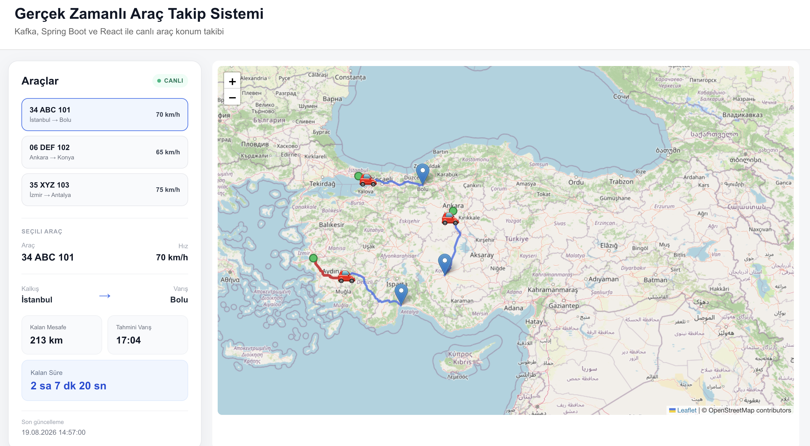
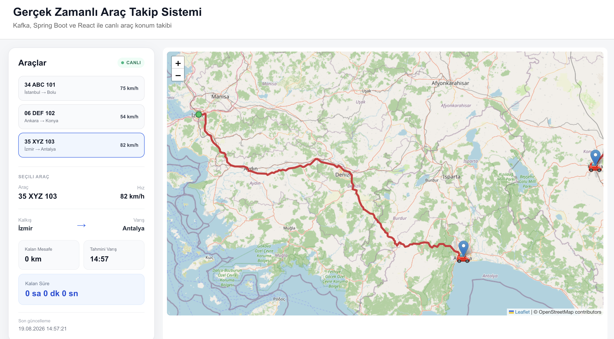

# Gerçek Zamanlı Araç Konum Takip Sistemi

Apache Kafka'nın gerçek zamanlı veri akışındaki kullanımını öğrenmek ve uygulamak amacıyla geliştirilmiş bir araç konum takip projesidir.

Sistem, OSRM üzerinden alınan gerçek yol rotası üzerinde bir aracın hareketini simüle eder. Oluşturulan konum bilgileri Kafka üzerinden iletilir, PostgreSQL veritabanına kaydedilir ve React + Leaflet tabanlı arayüzde gerçek zamanlı olarak görüntülenir.

## Kullanılan Teknolojiler

### Backend
- Java 21
- Spring Boot
- Spring Kafka
- Spring Data JPA
- PostgreSQL
- Maven

### Messaging
- Apache Kafka

### Frontend
- React
- Vite
- React Leaflet
- Leaflet
- OpenStreetMap

### Diğer
- Docker
- Docker Compose
- OSRM API


## Uygulama Görselleri

### Gerçek Zamanlı Araç Takip Dashboard'u




## Proje Akışı

```text
OSRM
  ↓
VehicleSimulatorService
  ↓
LocationEvent
  ↓
Kafka Producer
  ↓
vehicle-location-events
  ↓
Kafka Consumer
  ↓
PostgreSQL
  ↓
Spring Boot REST API
  ↓
React
  ↓
Leaflet / OpenStreetMap


